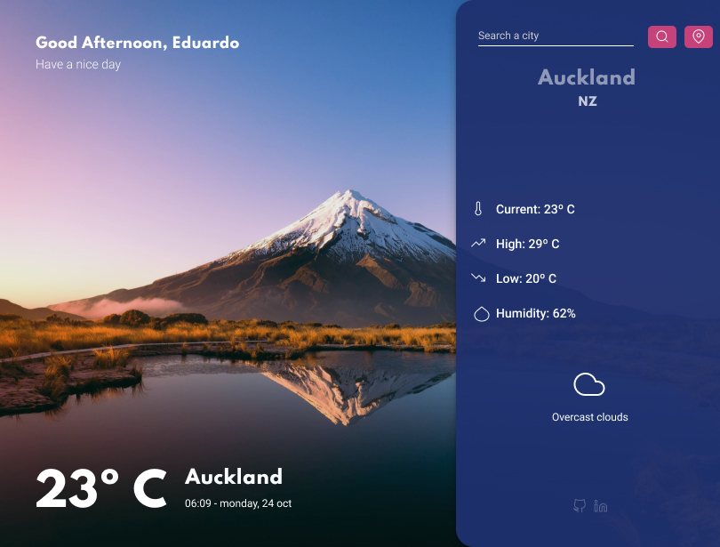

## About

This project allows you to find the current weather forecast for any city around the world. It also displays an image from the city.

<p>
  
  <br />
  <span>Project mockup - Made with <a href="https://www.figma.com" rel="noreferrer noopener" title="Project mockup link">Figma</a>.</span>
</p>

## Dependencies

- [NextJs](https://nextjs.org/) - Used to build static and dynamic websites.
- [OpenWeatherMap](https://openweathermap.org/) - Provides data about the weather.
- [Unsplash](https://unsplash.com/) - Free images and pictures.
- [React Lottie](https://github.com/chenqingspring/react-lottie) - Render After Effects animations on React based on lottie-web.
- [React Feather](https://github.com/feathericons/react-feather) - React components for [Feather icons](https://feathericons.com/).
- [date-fns](https://date-fns.org/) - Format and manipulate dates with JavaScript.
- [TailwindCSS](https://tailwindcss.com/) - CSS Framework to style the website.
- [Husky](https://typicode.github.io/husky/#/) - Git hooks, lint commit and 

## Getting Started

First, you should set the environment variables to run this project. [(Expose these environment variables to the browser by prefixing with "NEXT_PUBLIC_")](https://nextjs.org/docs/basic-features/environment-variables#exposing-environment-variables-to-the-browser).

Create an .env.local file with these keys.

- NEXT_PUBLIC_UNSPLASH_ACCESS_KEY=<<span style="color: #238636;">your_unsplash_access_key</span>>

- NEXT_PUBLIC_UNSPLASH_SECRET_KEY=<<span style="color: #238636;">your_unsplash_secret_key</span>>

- NEXT_PUBLIC_UNSPLASH_API_URL=<<span style="color: #238636;">unsplash_api_url</span>> (I suggest to use this url "https://api.unsplash.com/search/photos".)

- NEXT_PUBLIC_DEFAULT_IMAGE_URL=<<span style="color: #238636;">your_default_image_url</span>>

- NEXT_PUBLIC_OPEN_WEATHER_API_URL=<<span style="color: #238636;">openweather_api_url</span>> (I've used this url "https://api.openweathermap.org/data/2.5/weather").

- NEXT_PUBLIC_OPEN_WEATHER_API_KEY=<<span style="color: #238636;">your_open_weather_api_key</span>>

Then, install the dependencies:
```bash
yarn install
```

Running the development server:

```bash
yarn dev
```

That's it. Now you can open [http://localhost:3000](http://localhost:3000) with your browser to see the result.
